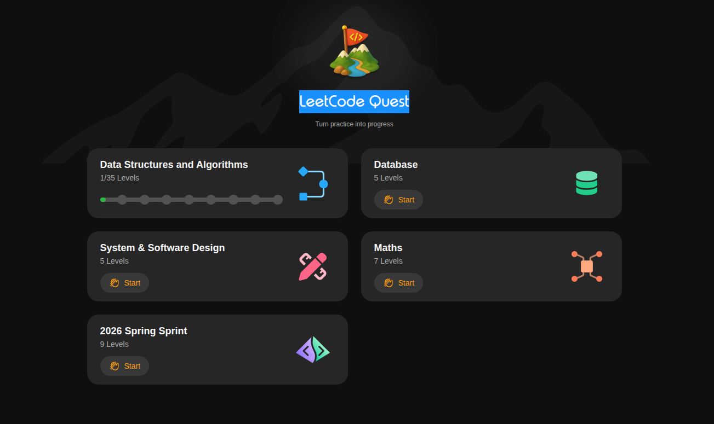

# LeetCode Quest

Tracker for [LeetCode Quest](https://leetcode.com/quest/) progression - LeetCode's structured learning tracks ("Turn practice into progress"). Each track contains multiple Levels; each Level groups a handful of LC problems. Quest sessions follow a lighter flow (single approach, technique-focused, no forced pattern extraction).

## Tracks

LeetCode Quest exposes these top-level tracks:
- **Data Structures and Algorithms** - 35 Levels (currently active)
- **Database** - 5 Levels
- **System & Software Design** - 5 Levels
- **Maths** - 7 Levels
- **2026 Spring Sprint** - 9 Levels

Below: Levels within the active track. Each Level becomes its own `##` section.

---

## Arrays 1

**Progress: 3 / 3 solved**

| Quest # | LC # | Problem | Difficulty | Status | Pattern / Technique | Link |
|---------|------|---------|-----------|--------|---------------------|------|
| Q1 | 1929 | Concatenation of Array | Easy | solved | Index Mapping | [→](../../problems/1929-concatenation-of-array/1929-concatenation-of-array.md) |
| Q2 | 1470 | Shuffle the Array | Easy | solved | Index Mapping | [→](../../problems/1470-shuffle-the-array/1470-shuffle-the-array.md) |
| Q3 | 485 | Max Consecutive Ones | Easy | solved | Running Max with Reset | [→](../../problems/485-max-consecutive-ones/485-max-consecutive-ones.md) |

## Arrays 2

**Progress: 0 / 3 solved**

| Quest # | LC # | Problem | Difficulty | Status | Pattern / Technique | Link |
|---------|------|---------|-----------|--------|---------------------|------|
| Q1 | 645 | Set Mismatch | Easy | not started | - | - |
| Q2 | 1365 | How Many Numbers Are Smaller Than the Current Number | Easy | not started | - | - |
| Q3 | 448 | Find All Numbers Disappeared in an Array | Easy | not started | - | - |
